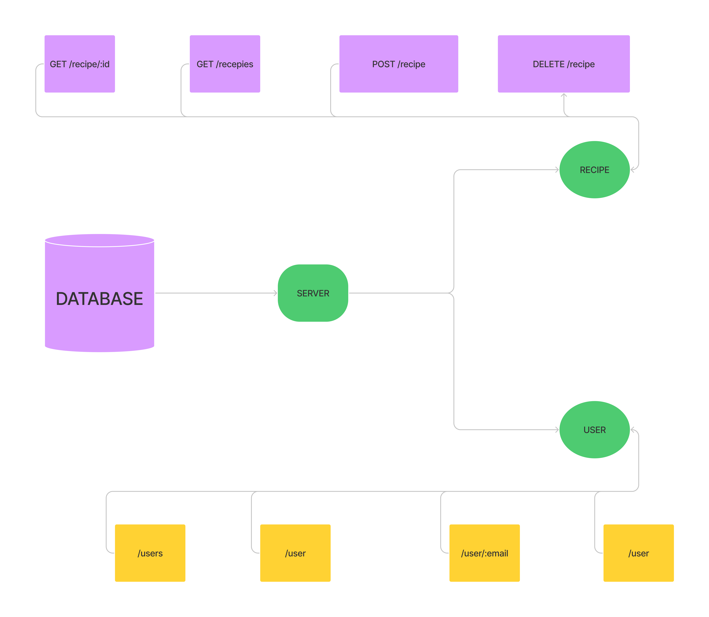

# RECIPE BOOK API

In this project we implemented basic concpets of API development. We perfomed basic crud applications for 2 models one
is USER Model and other is recipe model. I think this concept can help my team and for me to develop other projects also
so I selected this idea for development.

If we take any project that can be ecomerce site this same concepts are implemented there like we have users and we have
product. So I think that this project will help my team members to understand how real world projects get developed.

<p align='center'>
  
</p>

<br>
Base URL

```
localhost:4000/api/v1
```

# User Routes
<br>

### GET ALL USERS
```
GET /users
```

### GET ONE USER
```
GET /user/:email
```
- You need to provide email as parameter your url might look like this
```
{{base_url}}/user/random@gmail.com
```


### ADD USERS
```
POST /user
```
- You need to provide email and password in body in form of JSON your body might look like this
```
{
"email":"test@email.com,
"password":"demo@123"
}
```


### DELETE USER
```
DELETE /user
```
- You need to provide email and password in body in form of JSON your body might look like this
```
{
"email":"test@email.com,
"password":"demo@123"
}
```

<br><br>

# Recipe Routes
<br>

#### GET ALL Recipes
```
GET /recipes
```

#### GET ONE RECIPE
```
GET /recipe/:id
```
- You need to provide id as parameter your url might look like this
```
{{base_url}}/recipe/61f4dd1e79ac8292cb7b1a45
```

#### ADD RECIPE
```
POST /recipe
```
- You need to provide email and password in body in form of JSON your body might look like this
- Name is only required in recipe data with email and password other are optional as of now for testing purpose
```
{
"name":"Random Recipe 1",
"email":"random@gmail.com",
"password":"12345678",
"description":"",
"ingredients":"",
"electronic_instruments":"",
"preperation_time":"",
"precautions":"",
"nutrition_value":""
}
```

### DELETE RECIPE
```
DELETE /recipe
```
- You need to provide id, email and password in body in form of JSON your body might look like this
```
{
"id":"61f4dd1e79ac8292cb7b1a45"
"email":"test@email.com,
"password":"demo@123"
}
```